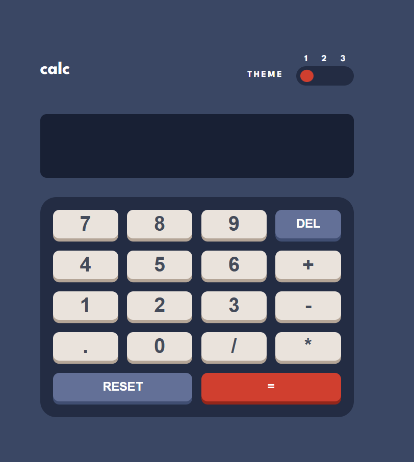
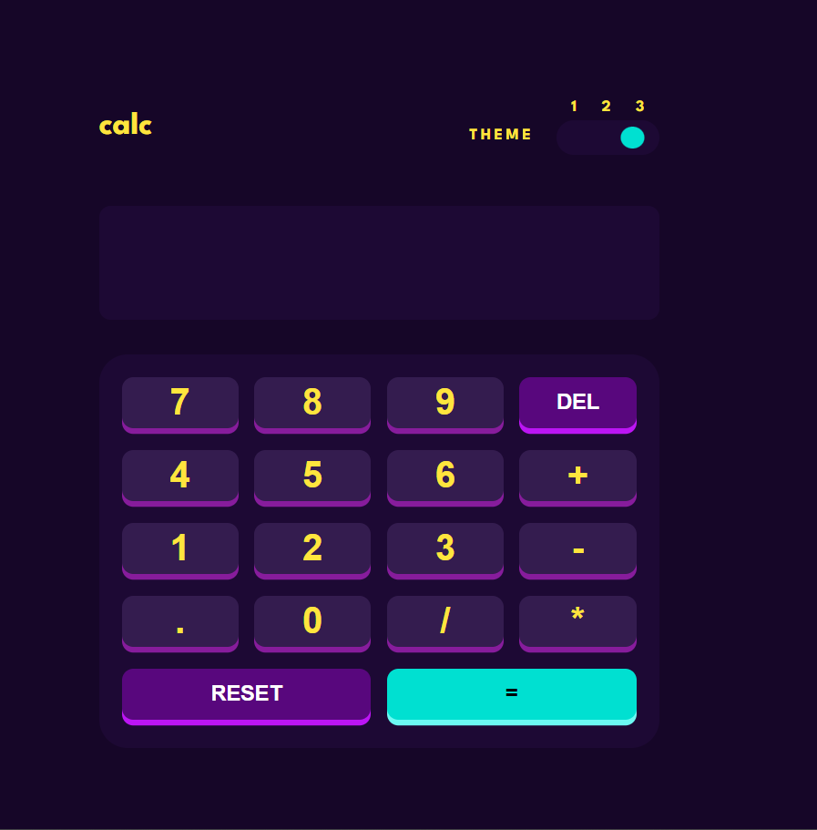

# 🧮 Themed Calculator

A custom calculator built using **JavaScript**, **HTML**, and **CSS**.  
It features **three unique themes** you can switch between for a personalized experience.

---

## 📸 Screenshots

| Theme 1 | Theme 2 | Theme 3 |
|--------|--------|--------|
|  |  |  |

> 📂 Place your images inside a `screenshots/` folder in the project root.

---

## 🚀 Live Demo

👉 [Try it here](https://yourusername.github.io/themed-calculator)

---

## 🧰 Tech Stack

- HTML
- CSS (Custom themes)
- JavaScript (Functional logic + theme switcher)

---

## 🧑‍💻 Author

Made with care by **Ismail**  
Built as a Frontend Mentor challenge

---

Let me know if you want to add install instructions or polish it further! Want me to help make the screenshots layout for GitHub look crisp too?
